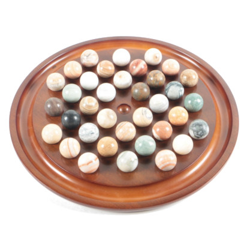

##Description
This code purpose is to create the peg solitaire game for a school project. For now, no GUI has been implemented; all ouputs 
are displayed in a terminal.

##Project Informations
* Authors : Ilias Goujgali, Benoit Perret, Doran Kayoumi
* Compilator : MinGW-g++ <6.3.0>
* Date : 20.12.18
* Version : 0.1
* Display language : French
* C++ standard : C++ 11

